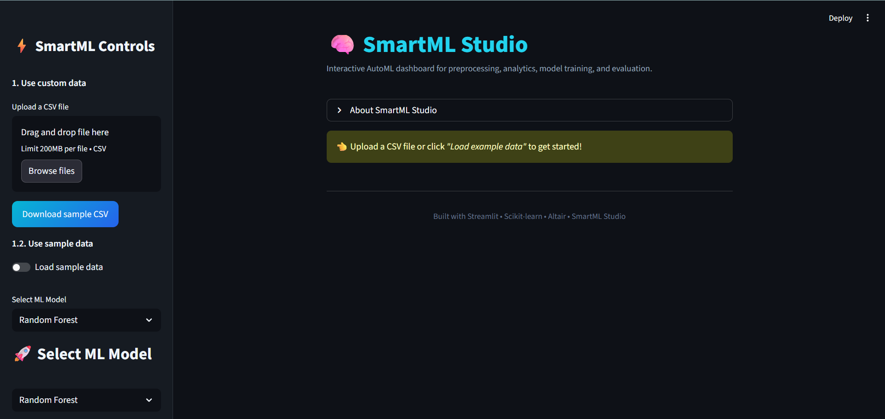
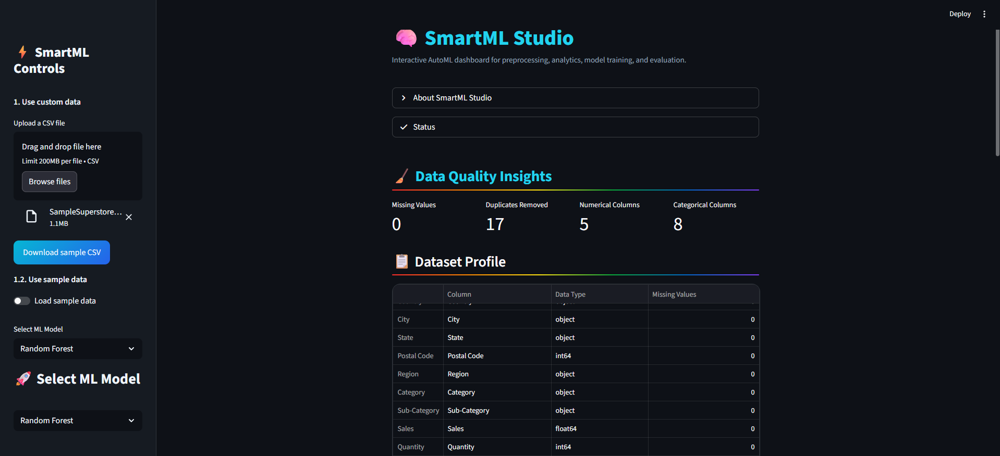
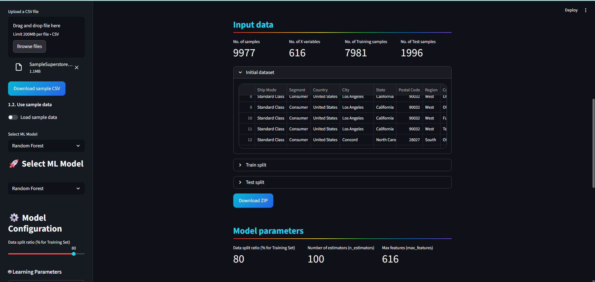
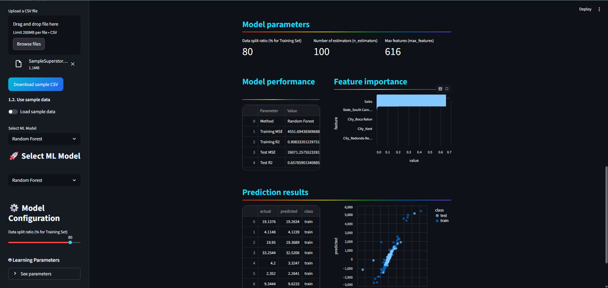

# SmartML Studio – Automated Machine Learning & Analytics Platform

SmartML Studio is an interactive machine learning platform designed for automated data preprocessing, model experimentation, performance evaluation, and analytical workflow visualization.

The platform streamlines traditional machine learning pipelines through an integrated dashboard-driven interface that enables rapid dataset analysis, preprocessing, model training, evaluation, and prediction workflows.

---

## Overview

SmartML Studio provides an end-to-end workflow for handling structured datasets and machine learning experimentation through an intuitive analytics environment.

The platform is focused on simplifying practical ML operations including preprocessing, feature analysis, model configuration, training, evaluation, and prediction analysis within a unified interface.

---

## Core Capabilities

- Automated dataset preprocessing
- Missing value handling and duplicate removal
- Feature scaling and encoding workflows
- Regression and classification model support
- Interactive model parameter configuration
- Real-time training and evaluation workflows
- Feature importance visualization
- Prediction analysis and performance metrics
- Export-ready processed datasets
- Interactive analytics dashboard

---

## Supported ML Workflows

```text
Dataset Upload
      ↓
Data Cleaning & Preprocessing
      ↓
Feature Engineering & Scaling
      ↓
Model Selection & Training
      ↓
Performance Evaluation
      ↓
Prediction & Analytical Visualization
```
---
## Technology Stack

| Technology          | Purpose                           |
| ------------------- | --------------------------------- |
| Python              | Core backend logic                |
| Streamlit           | Interactive dashboard interface   |
| Scikit-learn        | Machine learning workflows        |
| Pandas              | Data manipulation & preprocessing |
| NumPy               | Numerical computations            |
| Plotly / Matplotlib | Visualization & analytics         |
| OpenPyXL            | Export & file handling            |

---
## Supported Machine Learning Tasks
### Regression
- Linear Regression
- Random Forest Regressor
- Decision Tree Regressor
- Gradient Boosting Regressor

### Classification
- Logistic Regression
- Random Forest Classifier
- Decision Tree Classifier
- Support Vector Machine (SVM)
  
---
## Application Preview

### SmartML Studio Dashboard

<p align="center">
  
</p>

###  Prediction & Analytics Workflow

<p align="center">
  
</p>

<p align="center">
  
</p>

<p align="center">
  
</p>

---
## Platform Features
- Interactive ML dashboard interface
- Automated preprocessing workflows
- Dynamic model configuration
- Performance metric evaluation
- Dataset insights and profiling
- Feature importance analysis
- Export-ready analytical outputs
- Lightweight and modular architecture
---
## Practical Use Cases
- Machine learning experimentation
- Structured data preprocessing
- Educational and analytical ML workflows
- Rapid model evaluation pipelines
- Prediction and performance analysis
- Interactive ML demonstrations
---
## Architectural Highlights
- Dashboard-driven ML workflow execution
- Unified preprocessing and analytics pipeline
- Flexible regression and classification support
- Interactive parameter tuning and evaluation
- Designed for rapid experimentation and model comparison
--- 
## Run Locally
pip install -r requirements.txt
streamlit run streamlit_app.py
---
## Folder Structure
SmartML-Studio/

├── streamlit_app.py

├── requirements.txt

├── dataset/

├── output/

├── assets/

├── models/

└── README.md
---
## Future Enhancements
- AutoML workflow support
- Advanced hyperparameter optimization
- Model explainability integration
- Time-series forecasting support
- Cloud deployment workflows
- Model persistence and versioning
- Multi-user experiment tracking
---
## License

Licensed under the MIT License. See the [LICENSE](LICENSE) file for more information.


